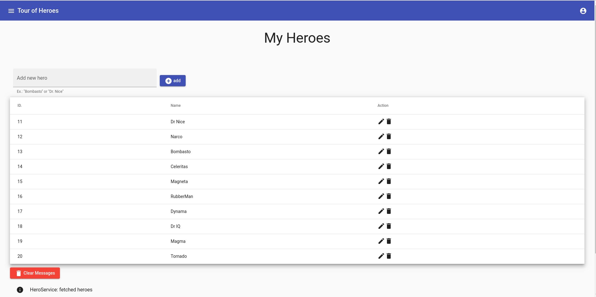

# Tour of Heroes ™

> ### Angular application that helps a staffing agency manage its stable of heroes.

This application has many of the features you'd expect to find in a data-driven application. It acquires and displays a list of heroes, edits a selected hero's detail, and navigates among different views of heroic data.

## Functionality overview

- Use built-in Angular directives to show and hide elements and display lists of hero data.
- Create Angular components to display hero details and show an array of heroes.
- Use one-way data binding for read-only data.
- Add editable fields to update a model with two-way data binding.
- Bind component methods to user events, like keystrokes and clicks.
- Enable users to select a hero from a master list and edit that hero in the details view.
- Format data with pipes.
- Create a shared service to assemble the heroes.
- Use routing to navigate among different views and their components.

This project was generated with [Angular CLI](https://github.com/angular/angular-cli) version 8.2.2.

## Development server

Run `ng serve` for a dev server. Navigate to `http://localhost:4200/`. The app will automatically reload if you change any of the source files.

## Code scaffolding

Run `ng generate component component-name` to generate a new component. You can also use `ng generate directive|pipe|service|class|guard|interface|enum|module`.

## Build

Run `ng build` to build the project. The build artifacts will be stored in the `dist/` directory. Use the `--prod` flag for a production build.

## Running unit tests

Run `ng test` to execute the unit tests via [Karma](https://karma-runner.github.io).

## Running end-to-end tests

Run `ng e2e` to execute the end-to-end tests via [Protractor](http://www.protractortest.org/).

## Further help

To get more help on the Angular CLI use `ng help` or go check out the [Angular CLI README](https://github.com/angular/angular-cli/blob/master/README.md).

## Running with Docker

You must have [Docker](https://docs.docker.com/install/) and [Docker Compose](https://docs.docker.com/compose/install/) installed.

In the root project folder build the image and fire up the container:

```bash
$ docker-compose up -d --build
```

Open your browser to http://localhost:4201 and you should see the app. Try making a change to the AppComponent’s template (src/app/app.component.html) within your code editor. You should see the app hot-reload. 

Ensure the app is running in the browser and test hot-reloading again. Try both the unit and e2e tests as well:

```bash
$ docker-compose exec tour-of-heroes ng test --watch=false
$ docker-compose exec tour-of-heroes ng e2e --port 4202
```

Stop the container before moving on:

```bash
$ docker-compose stop
```

# Screenshots



